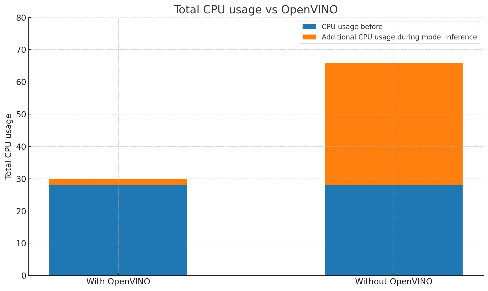

### Testing Strategy

Our project is intended to be used in schools, therefore a huge part of our project is gaining feedback from the students and teachers who will be primarily using this app. For this, we travelled to the **NAS Helen Allison School** to gain insight from the young children, aged 5–8, and from the teachers. In addition to this, we had sixth form students visit our lab sessions, who also provided feedback.

Apart from the user testing, the other large part of our project was testing the technical side of it, such as ensuring models worked well, and tweaking code and detection algorithms to our needs.

---

### Compatibility Testing

Another vital aspect of our project is ensuring that no matter what peripherals are being used, what operating system and what kinds of objects you use to select an answer, it always works as intended.

First of all, this project is in collaboration with **Intel**, so it is designed to work solely on Intel systems. However, the app will still function on other systems — it simply won’t be optimised.

As for the peripherals, we are only using **cameras** to test our app, so we have gathered a few different cameras to check and see if it would function the same regardless of brand and quality.

Finally we tested to see if the app would work on different OS. We ran the card detection app on **macOS** and **Linux**, however due to the way the file writing is done, this app **only works on Windows**.

---

## Performance Testing

### Performance Comparison: With and Without OpenVINO
To evaluate the impact of OpenVINO on our application’s performance, we ran a controlled test on a system using an Intel Core i5-12450H CPU with Intel UHD Graphics.

We compared two versions of the backend:

- One running YOLOv4-tiny natively (standard inference)

- The other running YOLOv4-tiny using OpenVINO optimised inference

#### CPU Usage Comparison

We monitored CPU load during active detection.

- Without OpenVINO: Average CPU usage hovered between 70-80%, with visible performance spikes and occasional stutter.
- With OpenVINO: Average CPU usage dropped to around 25-35%, and frame processing was more consistent.

This significant reduction in CPU load means the app runs smoother on lower-end devices and leaves more headroom for multitasking.

#### Detection Latency

We also measured the time between a user raising a card and the system reflecting the result on screen.

| Configuration         | Average Detection Latency|                                                          
|----------------------|----------------------|
| Without OpenVINO       | ~550 ms      | 
| Model Format         | ~1.2 ms       |

Thanks to OpenVINO’s optimized model execution, we saw more than a 2× improvement in responsiveness, making interactions feel much more immediate — a crucial factor for classroom use, especially with younger children.

**Notes on changing the confidence levels, colour detection accuracy within the code**

We performed various performance tweaks within the code, especially around:

- **Confidence thresholds** in YOLO detection — adjusting these helped us filter out weak hand/card detections and balance between sensitivity and false positives.
- **HSV color detection accuracy** — by tuning the HSV ranges and using Gaussian blur, erosion, and dilation, we improved the robustness of color detection even in different lighting conditions.

---

## User Acceptance Testing

To test our app, we had many opportunities to see how people of different ages would react to it, and to get feedback. Our main users were children and teachers from the NAS Helen Allison School and A-Level students from visiting sixth forms. These testers were chosen since they are all potential users for the app. The young children are our main users, and the older sixth form students were chosen to see whether the app would still be engaging and useful for older kids.

**Our testers were:**

- **Sophie**: 8 Year old Helen Allison Student  
- **Ben**: 5 Year old Helen Allison Student  
- **Joseph**: 31 Year old Helen Allison Student  
- **Becky**: 17 Year old Sixth Form Student

### Test Case 1

We gave each user **4 coloured cards**, and asked them to hold up the colour that corresponds to the correct answer on the PowerPoint quiz.

### Test Case 2

We displayed a question on the PowerPoint with **2 choices**, and asked the users to **raise their hand depending on which answer** they thought was correct.

### Test Case 3

We placed each of the **four coloured cards on the table**, angled the camera downward, and asked the students to **choose a card by simply placing their hand next to the card**.

### User Feedback Summary

| **Test Case** | **Enjoy** | **Neutral** | **Dislike** | **Feedback** |
|---------------|-----------|-------------|--------------|--------------|
| **Test Case 1 – Card Counting** For gaining feedback on model performance in different environments (School, Lab), as well as what interferes with the colour detection. | 4 | 0 | 0 | Young children were engaged and liked the quiz aspect of it. Older kids liked how it worked with the detection and had fun testing. Children and teachers liked that they could see the overlay of the card counter on top of the quiz. Teachers suggested separate views for teachers and students. |
| **Test Case 2 – Hand Counting** For gaining insight into how environment and number of students affects the model. | 4 | 0 | 0 | Children liked the interactive nature of this game mode, being able to raise your hand answering questions like “Do you like cats”. |
| **Test Case 3 – Tabletop Card Counting** To gain insight into whether the cards are detected correctly when the hand is near, and ensuring no overlap between the other cards and the hand is detected. | 3 | 1 | 0 | Teachers appreciated that this would help less abled students. Kids found this very accessible and easy to use and understand. |
